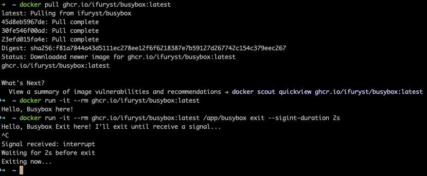

# busybox
Busybox is a simple task runner for Kubernetes and Docker test purposes.

## Quick Start

```bash
docker pull ghcr.io/ifuryst/busybox:latest

docker run -it --rm ghcr.io/ifuryst/busybox:latest

docker run -it --rm ghcr.io/ifuryst/busybox:latest /app/busybox exit --sigint-duration 2s
```


